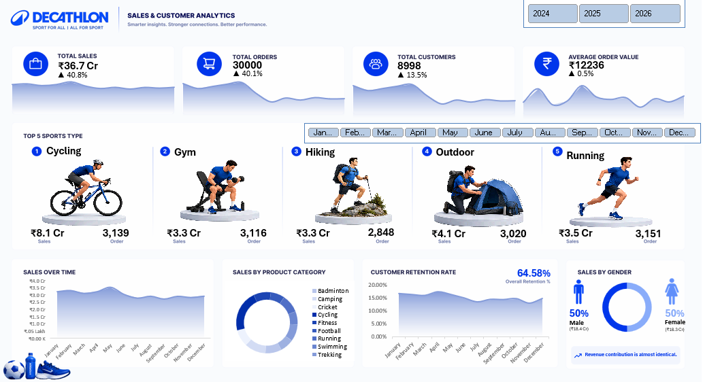
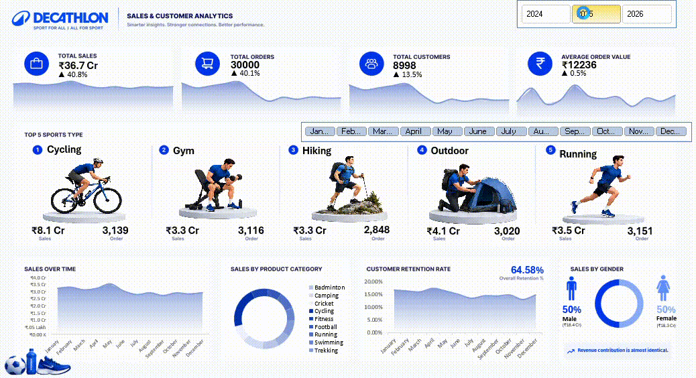

# Decathlon Sales & Customer Analytics (Excel)

An interactive Excel dashboard analyzing sales and customer data for Decathlon, built to demonstrate practical business analytics using Microsoft Excel.

## Project Overview

This project applies core business analytics techniques — data cleaning, KPI development, PivotTables, PivotCharts, and interactive dashboarding — to a Decathlon sales dataset entirely within Microsoft Excel.

The dashboard provides a consolidated view of sales performance and customer-related metrics, allowing users to explore patterns through interactive filters and visualizations.

## Dashboard Preview

## Dashboard Demo

## Dataset

- **Source:** Decathlon sales dataset
- **Tool:** Microsoft Excel
- **Size:** 30,000 rows × 39 columns
- **Format:** Excel
- **Fields:** Product_Category, Brand, Sport_Type, Quantity, Unit_Price, Discount_Percent, Discount_Amount, Sales_Amount, Final_Amount, Cost_Price, Profit, Store_ID, Store_Name, Payment_Method, Order_Date, and other sales-related fields
- **Note:** Raw dataset not included — sourced from a training dataset. Full working Excel file is available below.

📂 [Download Excel file (.xlsx)](Decathlon.xlsx)

## Data Cleaning & Preparation

- Removed duplicate records and blank rows
- Standardized date formats
- Standardized currency and numerical formats
- Structured the dataset as an Excel Table for analysis
- Prepared the data for PivotTables, PivotCharts, and dashboard visualizations

## Excel Techniques Used

- PivotTables
- PivotCharts
- Excel formulas
- Slicers
- Timelines
- Conditional formatting
- Excel Tables
- KPI calculations

## KPIs

| KPI | Value |
|---|---:|
| Total Sales | ₹36.7 Cr |
| Total Orders | 10,790 |
| Total Customers | 5,942 |
| Average Order Value | ₹12,236 |

## Dashboard Explanation

The dashboard brings together key performance indicators, charts, and interactive filters into a single Excel worksheet.

### Dashboard Components

- KPI summary cards
- Interactive charts
- Slicers
- Timeline
- PivotTables / PivotCharts
- Category, product, customer, or store analysis

## Key Insights

- The dashboard provides an overview of overall sales, order, customer, and average order value performance.
- Sales performance can be explored across different product categories, brands, sports, and stores.
- Customer and order patterns can be analyzed using interactive filters.
- Time-based analysis helps identify changes and trends in sales performance.
- Interactive slicers and timelines allow users to drill down into specific segments of the dataset.

## Interactivity

The dashboard uses Excel's interactive features to allow users to explore the data dynamically through:

- Slicers
- Timeline filters
- PivotCharts
- PivotTables

Users can filter the dashboard based on the available dimensions and observe changes in the displayed KPIs and visualizations.

## Technologies Used

- Microsoft Excel
- PivotTables
- PivotCharts
- Excel Tables
- Excel formulas
- Slicers
- Timelines
- Conditional Formatting

## Author

**Shreya Shekhar** — B.Sc. (Hons.) Mathematics, University of Delhi

[LinkedIn](https://www.linkedin.com/in/shreya-shekhar09/) · [GitHub](https://github.com/shreyashekhar879)
